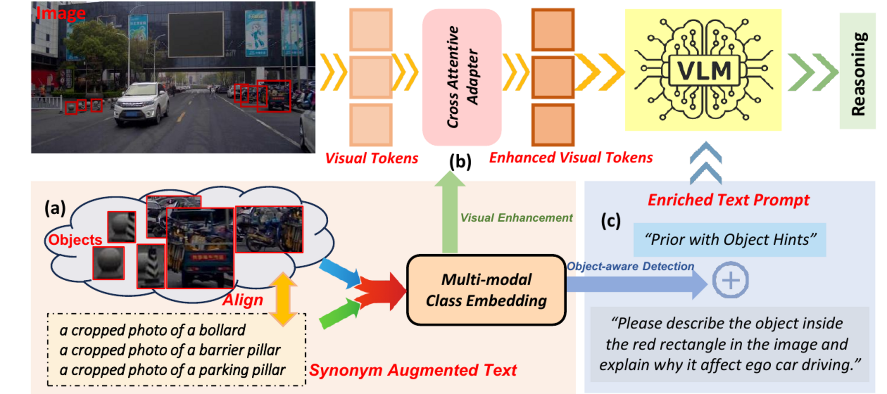

# Seeing Clearly, Reasoning Confidently

Official implementation of **Seeing Clearly, Reasoning Confidently: Plug-and-Play Remedies for Vision Language Model Blindness**.

This repository focuses on the CODA-LM experiments from our CVPR 2026 paper. The goal is to improve rare object recognition and object-centric reasoning in frozen vision-language models without finetuning the VLM backbone.

**Project page:** https://xinhu98.github.io/seeing/

## Highlights

- **Plug-and-play**: keeps the target VLM frozen and learns lightweight class-aware modules.
- **Rare object focused**: improves reasoning over long-tail driving objects such as bollards, debris, strollers, and traffic islands.
- **Dual enhancement**: refines visual tokens and injects object-aware text hints.
- **CODA-LM first**: the main release path targets CODA-LM region perception; cross-domain GeoBench experiments are optional.

<p align="center">
  
</p>

## Method

VLMs often generate fluent answers while missing the actual rare object in the marked region. We address this with multi-modal class embeddings learned from:

1. object-region visual features from vision foundation models,
2. synonym and attribute augmented text descriptions,
3. lightweight class prototypes updated with visual evidence.

The learned class embeddings are used in two complementary ways:

- **Visual token refinement**: a cross-attentive adapter enhances frozen VLM visual tokens with class-discriminative cues.
- **Text prompt enrichment**: class embeddings act as object-aware detectors and provide top-k object hints in the prompt.

## Main Benchmark

We use the region perception task from CODA-LM as the primary benchmark. Each sample asks the model to describe the object inside a red rectangle and explain why it affects ego-car driving.

| Split | Images | Region QA pairs | Notes |
| --- | ---: | ---: | --- |
| Train | 4,884 | 10,727 | Used to learn class embeddings and adapter |
| Test | 500 | 1,123 | Used for CODA-LM region perception evaluation |

The training set has a long-tailed class distribution. For example, `construction_vehicle` and `traffic_cone` are frequent, while `stroller`, `traffic_island`, `motorcycle`, `machinery`, and `sentry_box` are rare.

## Repository Status

This release repository is being cleaned from the research workspace. The current public-facing structure is:

```text
.
├── README.md
├── DATA.md
├── MODEL_ZOO.md
├── configs/
├── docs/
│   ├── index.html
│   └── assets/
├── scripts/
├── src/
└── tools/
```

The first complete code release will include:

- CODA-LM data preparation utilities,
- class embedding training,
- visual token refinement training,
- prompt-hint inference,
- CODA-LM GPT-score evaluation scripts,
- pretrained lightweight checkpoints.

## Quick Start

The executable CODA-LM pipeline will be released in the following form:

```bash
# 1. Prepare CODA-LM region-perception VQA files
bash scripts/prepare_coda.sh /path/to/CODA-root

# 2. Train or load multi-modal class embeddings
bash scripts/train_class_embeddings_coda.sh configs/coda_llava_7b.yaml

# 3. Train the visual refinement adapter
bash scripts/train_adapter_coda.sh configs/coda_llava_7b.yaml

# 4. Evaluate with visual refinement and object hints
bash scripts/eval_coda.sh configs/coda_llava_7b.yaml
```

See [DATA.md](DATA.md) for dataset layout and [MODEL_ZOO.md](MODEL_ZOO.md) for checkpoint plans.

## Project Page

The project page lives in [docs/index.html](docs/index.html). Enable GitHub Pages with:

```text
Settings -> Pages -> Deploy from a branch -> main / docs
```

## Additional Experiments

GeoBench is used as an optional cross-domain evaluation to show that the idea is not limited to ground-level autonomous driving imagery. It is not the main reproduction path of this repository.

## Citation

```bibtex
@inproceedings{hu2026seeing,
  title={Seeing Clearly, Reasoning Confidently: Plug-and-Play Remedies for Vision Language Model Blindness},
  author={Hu, Xin and Ni, Haomiao and Zhang, Yunbei and Hamm, Jihun and Li, Zechen and Ding, Zhengming},
  booktitle={Proceedings of the IEEE/CVF Conference on Computer Vision and Pattern Recognition},
  pages={18806--18815},
  year={2026}
}
```
