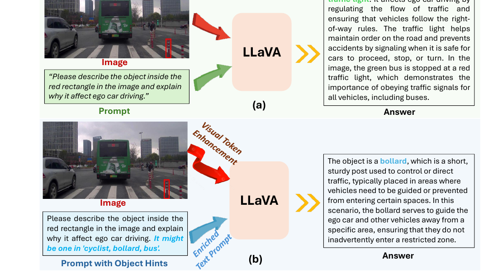

# Seeing Clearly, Reasoning Confidently

Official implementation of **Seeing Clearly, Reasoning Confidently: Plug-and-Play Remedies for Vision Language Model Blindness**.

This repository is to improve rare object recognition and object-centric reasoning in frozen vision-language models without finetuning the VLM backbone.

<p align="center">
  <a href="https://xinhu98.github.io/seeing/"></a>
  <a href="https://arxiv.org/abs/2602.19615"></a>
  <a href="https://openaccess.thecvf.com/content/CVPR2026/html/Hu_Seeing_Clearly_Reasoning_Confidently_Plug-and-Play_Remedies_for_Vision_Language_Model_CVPR_2026_paper.html"></a>
  <a href="https://github.com/XinHu98/seeing"></a>
</p>

## Highlights

- **Plug-and-play**: keeps the target VLM frozen and learns lightweight class-aware modules.
- **Rare object focused**: improves reasoning over long-tail driving objects such as bollards, debris, strollers, and traffic islands.
- **Dual enhancement**: refines visual tokens and injects object-aware text hints.
- **CODA-LM first**: the main release path targets CODA-LM region perception; cross-domain GeoBench experiments are optional.

<p align="center">
  
</p>

## Method

VLMs often generate fluent answers while missing the actual rare object in the marked region. We address this with multi-modal class embeddings learned from:

1. object-region visual features from vision foundation models,
2. synonym and attribute augmented text descriptions,
3. lightweight class prototypes updated with visual evidence.

The learned class embeddings are used in two complementary ways:

- **Visual token refinement**: a cross-attentive adapter enhances frozen VLM visual tokens with class-discriminative cues.
- **Text prompt enrichment**: class embeddings act as object-aware detectors and provide top-k object hints in the prompt.

## Main Benchmark

We use the region perception task from CODA-LM as the primary benchmark. Each sample asks the model to describe the object inside a red rectangle and explain why it affects ego-car driving.

| Split | Images | Region QA pairs | Notes |
| --- | ---: | ---: | --- |
| Train | 4,884 | 10,727 | Used to learn class embeddings and adapter |
| Test | 500 | 1,123 | Used for CODA-LM region perception evaluation |

The training set has a long-tailed class distribution. For example, `construction_vehicle` and `traffic_cone` are frequent, while `stroller`, `traffic_island`, `motorcycle`, `machinery`, and `sentry_box` are rare.

## Repository Status

This release currently focuses on the CODA-LM + LLaVA-1.5-7B path, the simplest baseline setting and the largest-gain setting in the paper.

```text
.
├── README.md
├── DATA.md
├── MODEL_ZOO.md
├── configs/
├── docs/
│   ├── index.html
│   └── assets/
├── scripts/
├── src/
└── tools/
```

The current code includes CODA-LM data preparation, DINO ROI feature extraction, class embedding training, visual token adapter training, and LLaVA-1.5 CODA-LM inference with `baseline`, `hints`, `refine`, and `full` modes.

## Quick Start

Install the Python dependencies and make the official LLaVA package available on `PYTHONPATH` or in your environment.

```bash
pip install -r requirements.txt
```

Then run the CODA-LM LLaVA-1.5-7B path. Set `CODA_ROOT` to the directory that contains `Train/` and `Test/`.

```bash
export CODA_ROOT=/path/to/CODA-data/CODA-LM

# 1. Prepare CODA-LM region-perception VQA files
bash scripts/prepare_coda.sh "${CODA_ROOT}"

# 2. Extract DINO ROI features for class embedding learning
bash scripts/extract_coda_region_features.sh

# 3. Train or load multi-modal class embeddings
bash scripts/train_class_embeddings_coda.sh configs/coda_llava_7b.yaml

# 4. Train the visual refinement adapter with frozen LLaVA-1.5-7B
bash scripts/train_adapter_coda.sh configs/coda_llava_7b.yaml

# 5. Evaluate with visual refinement and object hints
MODE=full bash scripts/eval_coda.sh configs/coda_llava_7b.yaml
```

For a quick baseline-only run, use `MODE=baseline NUM_SAMPLES=20 bash scripts/eval_coda.sh`.

The public metric summary includes a lightweight label-mention proxy for smoke tests. The paper's GPT-score evaluation protocol will be documented with the checkpoint release and should be run with your own API credentials.

See [DATA.md](DATA.md) for dataset layout and [MODEL_ZOO.md](MODEL_ZOO.md) for checkpoint plans.


## Citation

```bibtex
@inproceedings{hu2026seeing,
  title={Seeing Clearly, Reasoning Confidently: Plug-and-Play Remedies for Vision Language Model Blindness},
  author={Hu, Xin and Ni, Haomiao and Zhang, Yunbei and Hamm, Jihun and Li, Zechen and Ding, Zhengming},
  booktitle={Proceedings of the IEEE/CVF Conference on Computer Vision and Pattern Recognition},
  pages={18806--18815},
  year={2026}
}
```
